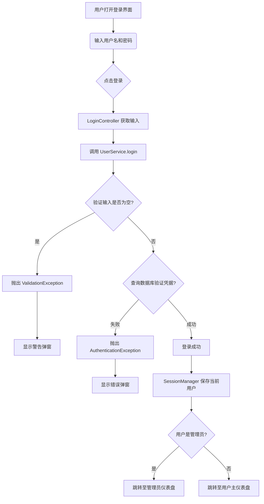
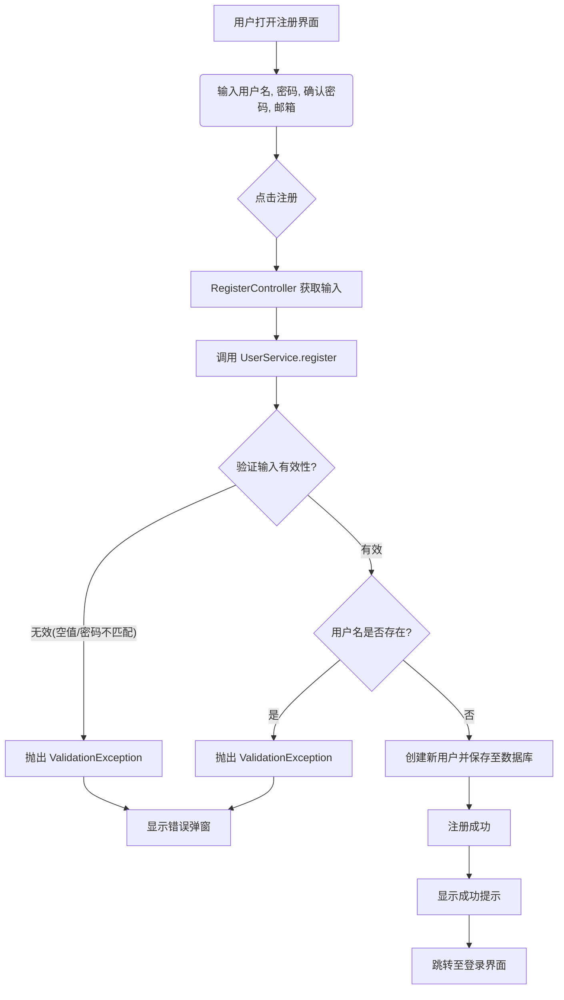
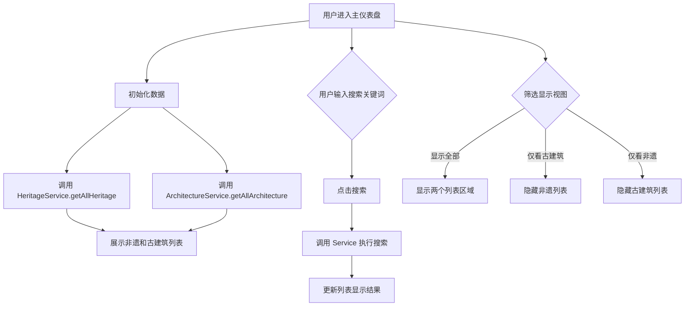
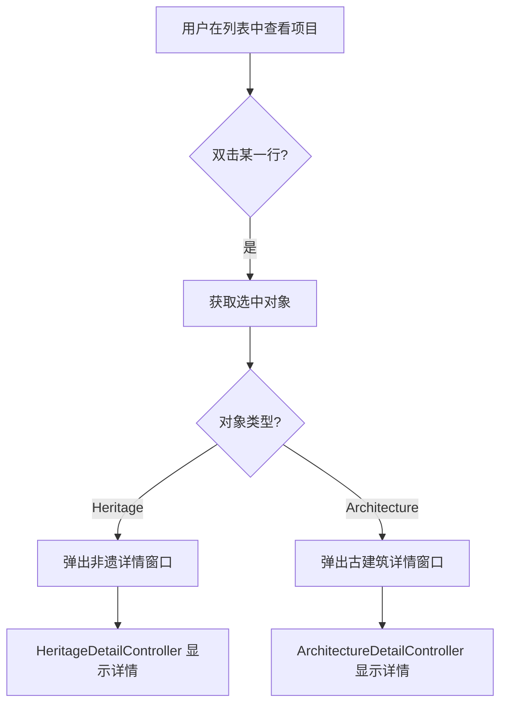
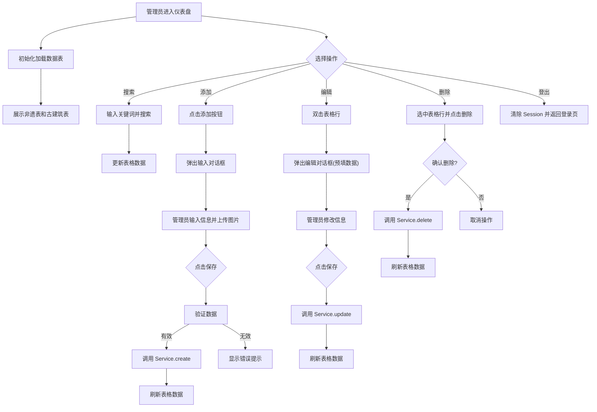

# 项目功能流程图

本文档包含了 `MuseumDisplay` 项目各主要功能的业务流程图。

## 1. 用户认证模块

### 1.1 登录流程
**涉及类**: [LoginController](file:///e:/github_repos/JavaPractice/MuseumDisplay/src/main/java/museum/controller/LoginController.java#15-67), [UserService](file:///e:/github_repos/JavaPractice/MuseumDisplay/src/main/java/museum/service/UserService.java#13-115)

### 1.2 注册流程
**涉及类**: [RegisterController](file:///e:/github_repos/JavaPractice/MuseumDisplay/src/main/java/museum/controller/RegisterController.java#14-68), [UserService](file:///e:/github_repos/JavaPractice/MuseumDisplay/src/main/java/museum/service/UserService.java#13-115)

## 2. 用户主面板模块

### 2.1 浏览与搜索流程
**涉及类**: [MainDashboardController](file:///e:/github_repos/JavaPractice/MuseumDisplay/src/main/java/museum/controller/MainDashboardController.java#21-157), `HeritageService`, `ArchitectureService`

### 2.2 查看详情流程
**涉及类**: [MainDashboardController](file:///e:/github_repos/JavaPractice/MuseumDisplay/src/main/java/museum/controller/MainDashboardController.java#21-157), `HeritageDetailController`, `ArchitectureDetailController`

## 3. 管理员面板模块

管理员面板主要负责内容的增删改查（CRUD）。

### 3.1 非遗与古建筑管理 (CRUD)
**涉及类**: [AdminDashboardController](file:///e:/github_repos/JavaPractice/MuseumDisplay/src/main/java/museum/controller/AdminDashboardController.java#28-486), `HeritageService`, `ArchitectureService`

